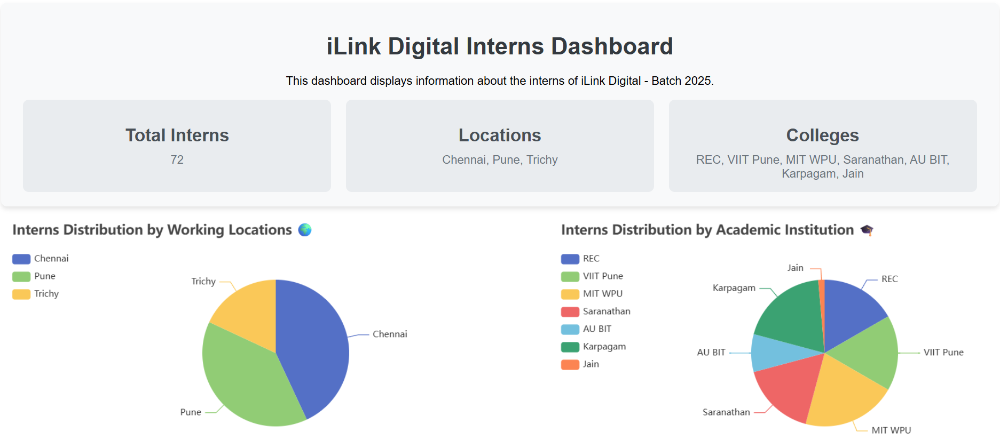
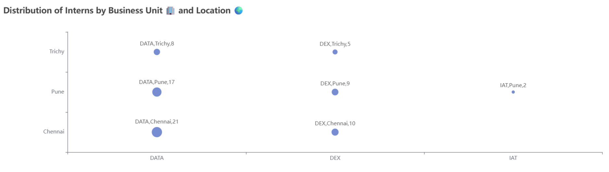
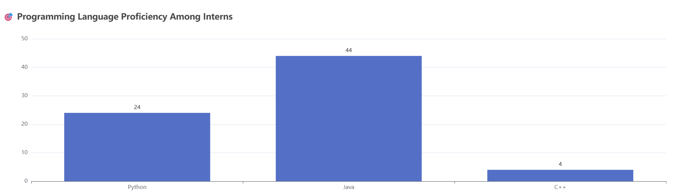

# Angular ECharts Dashboard

## Project Overview

This project is an Angular application that displays a dashboard with various charts visualizing data about interns at iLink Digital. The dashboard includes:

- A header with additional information.
- Charts for:
  - Interns by Location (Pie Chart)
  - Interns by College (Pie Chart)
  - Interns by Allocated Business Unit (Scatter Plot)
  - Interns by Programming Language (Bar Chart)

## Project Setup

### Prerequisites

- Node.js and npm installed.
- Angular CLI installed globally (`npm install -g @angular/cli`).
- A C# backend service to fetch data from an Excel sheet.
  
### Installation

1. Clone the repository:
   ```bash
   git clone https://github.com/abdullahfirdowsi/angular-echarts-dashboard.git
   cd angular-echarts-dashboard
   
2. Install dependencies:
   ```bash
   npm install
   
3. Run the application:
   ```bash
   ng serve

Open your browser and navigate to http://localhost:4200/

### Project Output Screenshot





## Data
The data is fetched from a C# backend service that reads data from an Excel sheet. The backend service provides various datasets used in the visualizations.

### Backend Service
The C# backend service is responsible for reading data from the Excel sheet and providing it to the Angular frontend. The service exposes endpoints for each dataset required by the frontend components.

- Running the Backend Service
- Ensure the C# backend service is running. Follow the instructions provided in the backend service repository to set it up and run it.

The Angular application will fetch data from the backend service endpoints.

## Components

### TitleDescriptionComponent

- Displays the title and description of the application, along with additional information such as total interns, locations, and colleges.

### InternsByLocationComponent

- Displays a pie chart showing the distribution of interns by location.

### InternsByCollegeComponent

- Displays a pie chart showing the distribution of interns by college.

### InternsByAllocatedBUComponent

- Displays a scatter plot showing the relationship between allocated business units and locations, with the count of interns.

### InternsByProgrammingLanguageComponent

- Displays a bar chart showing the distribution of interns by programming language.

## Features

- **Header Section**: Displays the title, description, and additional information about the interns.
- **Chart Selection Dropdown**: Allows the user to select which chart to view.
- **Pie Charts**:
  - Interns by Location
  - Interns by College
- **Scatter Plot**: Interns by Allocated Business Unit and Location
- **Bar Chart**: Interns by Programming Language
